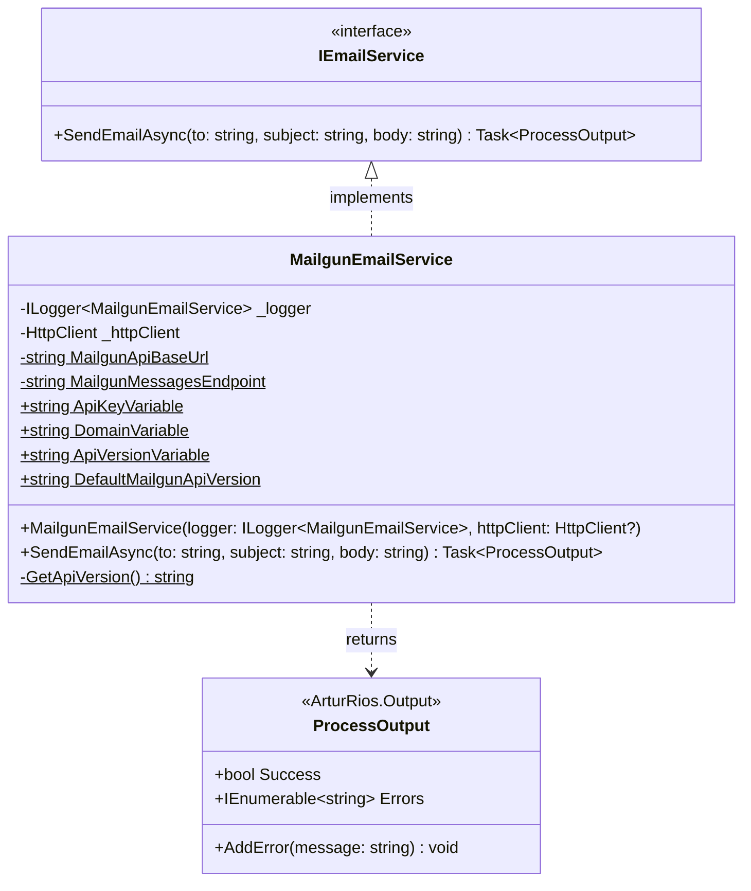

Utilities for different messaging formats and protocols for .NET applications.
Right now, the library includes a Mailgun email service, but more features and protocols may be added in the future, as well as support for more email providers.

Contributions are welcome!

## Installation

Install the package via the .NET CLI:

```bash
dotnet add package ArturRios.Messaging
```

Or via the NuGet Package Manager:

```powershell
Install-Package ArturRios.Messaging
```

## Requirements

- .NET 10.0 or later
- Environment variables for service configuration (see [Configuration](#configuration))

## Dependencies

| Package | Purpose |
|---|---|
| [ArturRios.Output](https://www.nuget.org/packages/ArturRios.Output) | Structured operation result type (`ProcessOutput`) |

## Features

- **Email** — send transactional emails via [Mailgun](https://www.mailgun.com/) with a clean async interface
- Designed for dependency injection — register services through the standard `IServiceCollection` pattern
- Returns structured `ProcessOutput` results (from [ArturRios.Output](https://www.nuget.org/packages/ArturRios.Output)) rather than throwing exceptions, making error handling predictable

## Configuration

### Mailgun Email Service

Set the following environment variables before calling `SendEmailAsync`:

| Variable | Required | Default | Description |
|---|---|---|---|
| `MAILGUN_API_KEY` | Yes | — | Your Mailgun private API key |
| `MAILGUN_DOMAIN` | Yes | — | Your verified Mailgun sending domain |
| `MAILGUN_API_VERSION` | No | `v3` | Mailgun API version used to build the request URL. When unset or blank, `v3` is used |

Requests are sent to `https://api.mailgun.net/{MAILGUN_API_VERSION}/{MAILGUN_DOMAIN}/messages`.
Environment variables are read on every `SendEmailAsync` call, so changes take effect without recreating the service.

If `MAILGUN_API_KEY` or `MAILGUN_DOMAIN` is unset or blank, `SendEmailAsync` returns a failed
`ProcessOutput` naming the missing variable and sends nothing — rather than issuing an unauthenticated
request against an empty domain and reporting whatever Mailgun makes of it.

The credential is attached to each request, never to the client's `DefaultRequestHeaders`. That matters
because the documented registration is `AddHttpClient`, which hands the service a client it does not own:
writing a credential onto that client's defaults would race with concurrent sends and leave the Mailgun key
attached to every later request the client makes.

## Usage

### Dependency Injection

Register `MailgunEmailService` with your DI container:

```csharp
using ArturRios.Messaging.Email;

builder.Services.AddHttpClient<IEmailService, MailgunEmailService>();
```

### Sending an Email

```csharp
using ArturRios.Messaging.Email;

public class NotificationService(IEmailService emailService)
{
    public async Task NotifyAsync(string recipient)
    {
        var output = await emailService.SendEmailAsync(
            to: recipient,
            subject: "Welcome!",
            body: "Thanks for signing up."
        );

        if (!output.Success)
        {
            foreach (var error in output.Errors)
                Console.WriteLine(error);
        }
    }
}
```

### Without Dependency Injection

```csharp
using ArturRios.Messaging.Email;
using Microsoft.Extensions.Logging.Abstractions;

var service = new MailgunEmailService(NullLogger<MailgunEmailService>.Instance);
var output = await service.SendEmailAsync("to@example.com", "Hello", "World");
```

## Class Diagram



## Testing

The test suite is xUnit, and every test is named with the Given / When / Then pattern. Every test class
carries a `Category` trait, so the two kinds can be run — and reported — separately:

```bash
dotnet test src/ArturRios.Messaging.sln --filter "Category=Unit"
dotnet test src/ArturRios.Messaging.sln --filter "Category=Functional"
```

Unit tests exercise the code in isolation against test doubles.
Functional tests send through a real HTTP server on the loopback interface and inspect the request that arrives.
CI runs the two as separate jobs, and both must pass before a pull request can be merged.

## Versioning

Semantic Versioning (SemVer). Breaking changes result in a new major version. New methods or non-breaking behavior
changes increment the minor version; fixes or tweaks increment the patch.

## Build, test and publish

Use the official [.NET CLI](https://learn.microsoft.com/en-us/dotnet/core/tools/) to build, test and publish the project and Git for source control.
If you want, optional helper toolsets I built to facilitate these tasks are available:

- [Dotnet Tools](https://github.com/artur-rios/dotnet-tools)
- [Python Dotnet Tools](https://github.com/artur-rios/python-dotnet-tools)

## Legal Details

This project is licensed under the [MIT License](https://en.wikipedia.org/wiki/MIT_License). A copy of the license is available at [LICENSE](https://github.com/artur-rios/dotnet-messaging/blob/main/LICENSE) in the repository.
