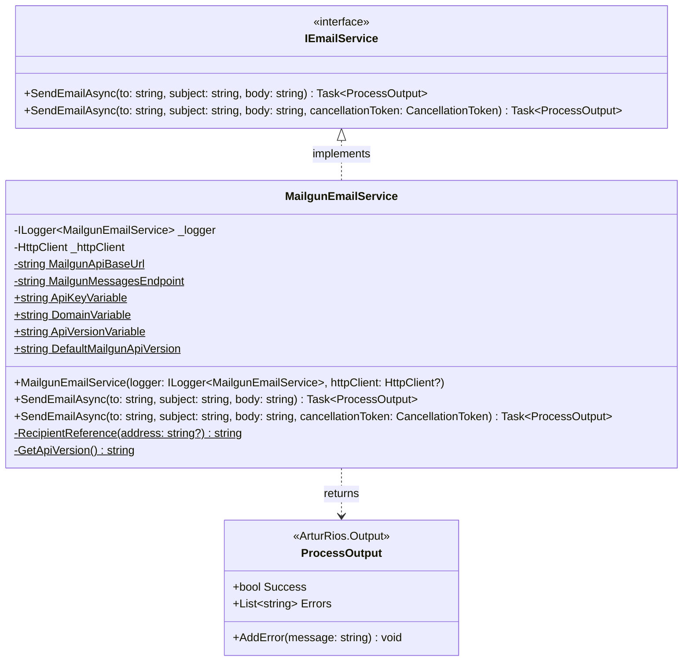

Utilities for different messaging formats and protocols for .NET applications.
Right now, the library includes a Mailgun email service, but more features and protocols may be added in the future, as well as support for more email providers.

Contributions are welcome!

## Installation

Install the package via the .NET CLI:

```bash
dotnet add package ArturRios.Messaging
```

Or via the NuGet Package Manager:

```powershell
Install-Package ArturRios.Messaging
```

## Requirements

- .NET 10.0 or later
- Environment variables for service configuration (see [Configuration](#configuration))

## Dependencies

| Package | Purpose |
|---|---|
| [ArturRios.Output](https://www.nuget.org/packages/ArturRios.Output) | Structured operation result type (`ProcessOutput`) |

## Features

- **Email** — send transactional emails via [Mailgun](https://www.mailgun.com/) with a clean async interface
- Designed for dependency injection — register services through the standard `IServiceCollection` pattern
- Returns structured `ProcessOutput` results (from [ArturRios.Output](https://www.nuget.org/packages/ArturRios.Output)): missing configuration and messages Mailgun rejects are reported as errors rather than thrown. Transport failures from `HttpClient` (no network, a timeout) still throw
- Cancellable — `SendEmailAsync` has an overload taking a `CancellationToken`, which aborts the HTTP request

## Configuration

### Mailgun Email Service

Set the following environment variables before calling `SendEmailAsync`:

| Variable | Required | Default | Description |
|---|---|---|---|
| `MAILGUN_API_KEY` | Yes | — | Your Mailgun private API key |
| `MAILGUN_DOMAIN` | Yes | — | Your verified Mailgun sending domain |
| `MAILGUN_FROM` | No | `postmaster@{MAILGUN_DOMAIN}` | The sender of every message: an address (`no-reply@example.com`) or a display name and an address (`Example <no-reply@example.com>`). When unset or blank, the domain's postmaster is used, with no display name |
| `MAILGUN_API_VERSION` | No | `v3` | Mailgun API version used to build the request URL. When unset or blank, `v3` is used |

Requests are sent to `https://api.mailgun.net/{MAILGUN_API_VERSION}/{MAILGUN_DOMAIN}/messages`, as plain text
from `MAILGUN_FROM`, or from `postmaster@{MAILGUN_DOMAIN}` when it is not set. Set `MAILGUN_FROM` in production:
the postmaster default is a working fallback, not a sender recipients should see. Its address normally has to be
on `MAILGUN_DOMAIN` (or another domain verified in Mailgun) for Mailgun to accept it.
Environment variables are read on every `SendEmailAsync` call, so changes take effect without recreating the service.

If `MAILGUN_API_KEY` or `MAILGUN_DOMAIN` is unset or blank, or `MAILGUN_FROM` is set but is not exactly one
address (with or without a display name), `SendEmailAsync` returns a failed `ProcessOutput` naming the
variable and sends nothing — rather than issuing an unauthenticated
request against an empty domain and reporting whatever Mailgun makes of it.

The credential is attached to each request, never to the client's `DefaultRequestHeaders`. That matters
because the documented registration is `AddHttpClient`, which hands the service a client it does not own:
writing a credential onto that client's defaults would race with concurrent sends and leave the Mailgun key
attached to every later request the client makes.

The recipient address is personal data, so it is never logged. Log lines carry a stable reference to it instead —
the first twelve hex characters of the SHA-256 of the trimmed, lower-cased address — which is enough to tell
whether several lines concern the same recipient without disclosing who it is.

## Usage

### Dependency Injection

Register `MailgunEmailService` with your DI container:

```csharp
using ArturRios.Messaging.Email;

builder.Services.AddHttpClient<IEmailService, MailgunEmailService>();
```

### Sending an Email

```csharp
using ArturRios.Messaging.Email;

public class NotificationService(IEmailService emailService)
{
    public async Task NotifyAsync(string recipient)
    {
        var output = await emailService.SendEmailAsync(
            to: recipient,
            subject: "Welcome!",
            body: "Thanks for signing up."
        );

        if (!output.Success)
        {
            foreach (var error in output.Errors)
                Console.WriteLine(error);
        }
    }
}
```

### Cancellation

Pass a `CancellationToken` — a request's `HttpContext.RequestAborted`, a worker's stopping token — to abort the
send:

```csharp
var output = await emailService.SendEmailAsync(recipient, "Welcome!", "Thanks for signing up.", cancellationToken);
```

An already-canceled token throws `OperationCanceledException` before anything is sent; canceling mid-send aborts
the HTTP request and throws the same. The three-argument overload is unchanged. On `IEmailService` the new
overload has a default implementation, so existing implementations keep compiling: it checks the token and then
calls the three-argument overload.

### Without Dependency Injection

```csharp
using ArturRios.Messaging.Email;
using Microsoft.Extensions.Logging.Abstractions;

var service = new MailgunEmailService(NullLogger<MailgunEmailService>.Instance);
var output = await service.SendEmailAsync("to@example.com", "Hello", "World");
```

## Class Diagram


```mermaid
classDiagram
    class IEmailService {
        <<interface>>
        +SendEmailAsync(to: string, subject: string, body: string) Task~ProcessOutput~
        +SendEmailAsync(to: string, subject: string, body: string, cancellationToken: CancellationToken) Task~ProcessOutput~
    }

    class MailgunEmailService {
        -ILogger~MailgunEmailService~ _logger
        -HttpClient _httpClient
        -string MailgunApiBaseUrl$
        -string MailgunMessagesEndpoint$
        +string ApiKeyVariable$
        +string DomainVariable$
        +string ApiVersionVariable$
        +string DefaultMailgunApiVersion$
        +MailgunEmailService(logger: ILogger~MailgunEmailService~, httpClient: HttpClient?)
        +SendEmailAsync(to: string, subject: string, body: string) Task~ProcessOutput~
        +SendEmailAsync(to: string, subject: string, body: string, cancellationToken: CancellationToken) Task~ProcessOutput~
        -RecipientReference(address: string?) string$
        -GetApiVersion() string$
    }

    class ProcessOutput {
        <<ArturRios.Output>>
        +bool Success
        +List~string~ Errors
        +AddError(message: string) void
    }

    IEmailService <|.. MailgunEmailService : implements
    MailgunEmailService ..> ProcessOutput : returns
```

## Legal Details

This project is licensed under the [MIT License](https://en.wikipedia.org/wiki/MIT_License). A copy of the license is available at [LICENSE](https://github.com/artur-rios/dotnet-messaging/blob/main/LICENSE) in the repository.
